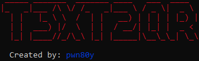
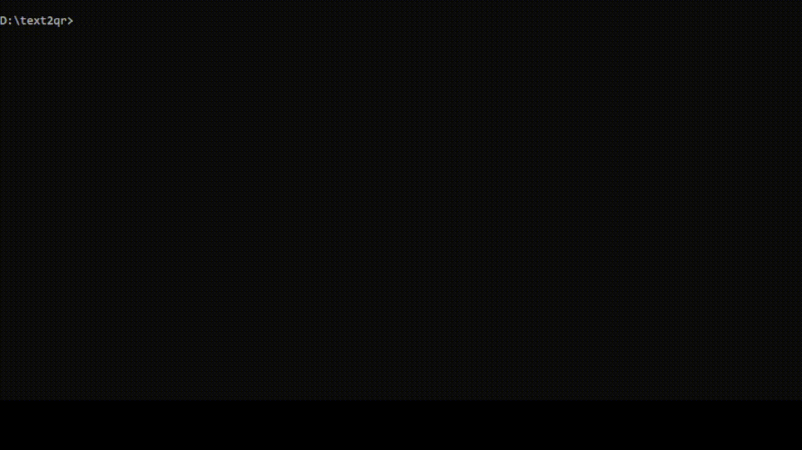

<h1 align="center">
  <br>
  <a href="http://www.amitmerchant.com/electron-markdownify"></a>
  <br>
  T3XT2QR
  <br>
</h1>

<h4 align="center">:sunglasses:A Python Script to generate QR code from text</h4>

<p align="center">
  <a href="https://www.python.org/">
    
  </a>
  </p>
  <p align="center">
  <a href="https://github.com/pwnb0y/text2qr/blob/main/LICENSE"></a>
  <a href="https://twitter.com/pwn_b0y">
      
  </a>
  <a href="https://www.linkedin.com/in/vickyaryan/">
    
  </a>
   </a>
  <a href="https://pwnb0y.medium.com/">
    
  </a>
   <a href="">
    
  </a>
</p>

<p align="center">
  <a href="#key-features">Key Features</a> •
   <a href="#how-to-download">How to Download</a> •
  <a href="#how-to-use">How To Use</a> •
  <a href="#license">License</a>
</p>



## Key Features

* Very easy to use
  - You can use it in very easy way.
* Input is supplied by two ways
  - For generating the qr code you can supply input by command line argument as well as simple after running the script.
* Support Multiple colour of QR output
  - You can specify the color of backgraound and also filling color of qr code.
* Custom Output file
  - You can specify custom file name with .png extension.
* Cross platform
   - Windows, macOS and Linux ready.
---
> **Note:** 
> _To clone and run this application, you'll need to download **[Git](https://git-scm.com)** and **[Python](https://python.org/)** on your computer_.  
## How To Download

```bash
# Clone this repository
$ git clone https://github.com/pwnb0y/text2qr.git

# Go into the repository
$ cd text2qr

# Install dependencies
$ pip install -r requirements.txt
```

## How To Use

```bash
# Run the app
$ python text2qr.py

# Run with argument
$ python text2qr.py -t "letmemake" -o lol.png

# Run with color argument default for fill color is black and for back is white
$ python text2qr.py -t -f black -b red

```

## Support

<a href="https://www.buymeacoffee.com/pwnb0y" target="blank"></a>

## LICENSE
**MIT**

---

> [Medium](https://pwnb0y.medium.com) &nbsp;&middot;&nbsp;
> GitHub [@pwnb0y](https://github.com/pwnb0y) &nbsp;&middot;&nbsp;
> Twitter [@pwn_b0y](https://twitter.com/pwn_b0y)

